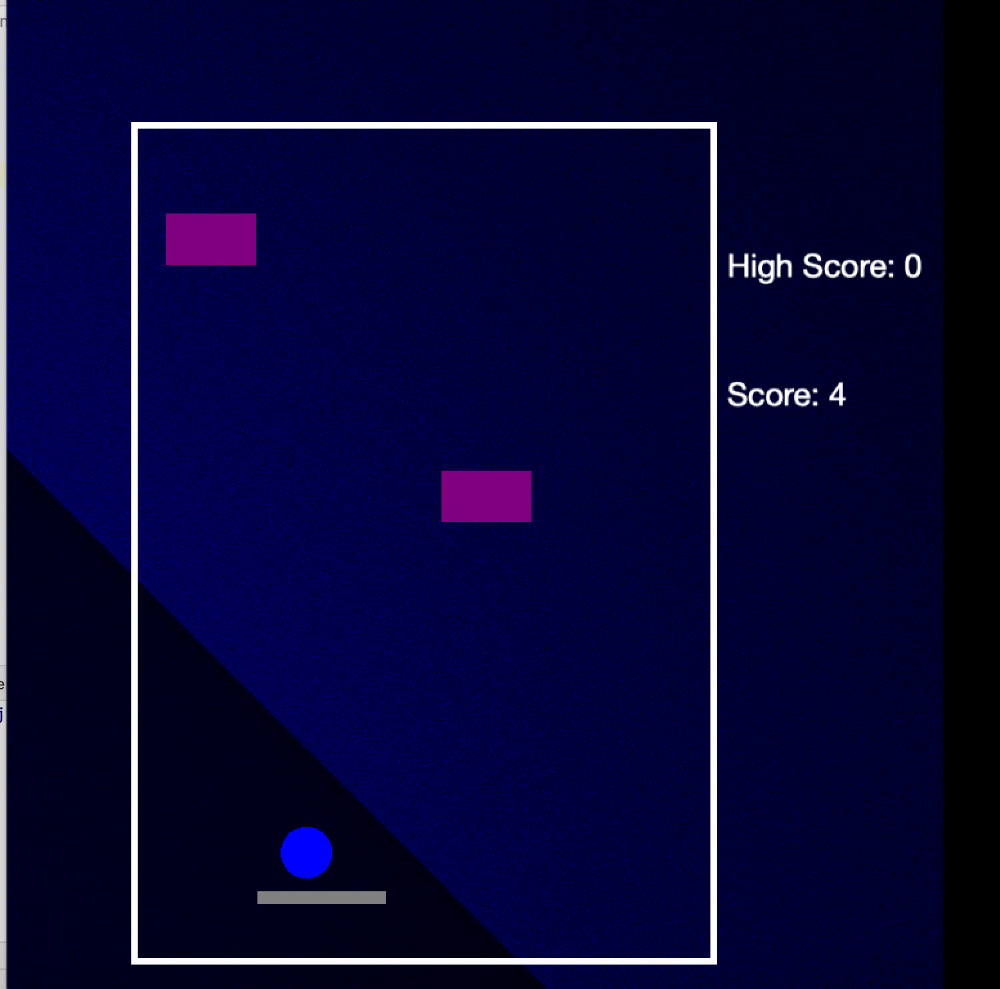

# **Ball Blaster**

The objective of this game is to score more points by surviving and hitting the purple enemies with the block. 

## **Dependencies**
* [Cinder](https://libcinder.org/download)
* [Clang](https://clang.llvm.org/)
* [Cmake](https://cmake.org/)

## **MacOS**
```console
$ brew install --cask cinder 
$ brew install cmake
$ brew install llvm
```
You must have a c++ ide(preferably clion) and an Xcode with version no later than
12.4 to build this project.

## **Controls**
Key | Action
------------ | -------------
`leftArrow` | Moves player board to left
`rightArrow` | Moves player board to right
`s` | Starts the game
`r` | Restarts the game

## **Contact**
For any bugs and advices, contact me at
**yaowenc2@illinois.edu**.

## **Licence**
Released under the [MIT License](https://github.com/jonschlinkert/update-copyright/blob/master/LICENSE).


